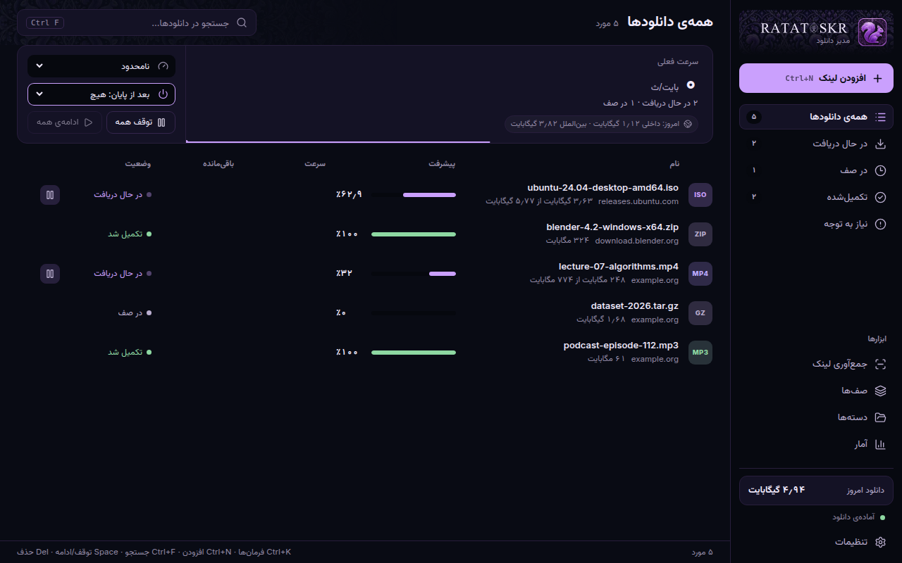

<div dir="rtl">

<p align="center">
  
</p>

<p align="center">
  <b>مدیر دانلود سریع و محلی برای ویندوز و اندروید</b><br>
  فارسی‌محور و دوزبانه · دانلود تکه‌تکه و قابل‌ازسرگیری · یوتیوب و اینستاگرام داخل برنامه
</p>

<p align="center">
  <a href="https://github.com/sajjadka21/ratatoskr/releases/latest"></a>
  · <a href="README.md">English</a>
</p>

<p align="center">
  
</p>

راتاتوسک (Ratatoskr) نام سنجابی در اساطیر نوردیک است که از بالای درخت جهان تا ریشه‌هایش می‌دود و پیام می‌برد؛ این برنامه فایل‌ها را پایین می‌آورد. حساب کاربری، ردیابی و سرور مرکزی ندارد: موتور دانلود، پایگاه‌داده و تنظیمات همه روی رایانه‌ی خودتان هستند.

## امکانات

- **دانلود:** تکه‌تکه و قابل‌ازسرگیری با تعداد اتصال تطبیقی، آینه‌ها (mirror)، تلاش دوباره‌ی خودکار و بازیابی بعد از خاموشی ناگهانی.
- **صف‌ها:** اولویت، محدودیت برای هر میزبان، زمان‌بندی (یک‌بار، روزانه، روزهای کاری، تکرار شونده) و کار پایانی (اعلان، خروج، خواب، خاموشی).
- **دسته‌ها و قانون‌ها** برای انتخاب خودکار پوشه، محدودیت سرعت و آمار ترافیک داخلی/بین‌المللی.
- **جمع‌آوری لینک** از یک صفحه یا متن، و **site grabber** برای خزیدن آرام در یک سایت (عمق، همان میزبان/پوشه، نوع فایل).
- **جعبه‌ی شناور (Drop box)** برای رها کردن لینک‌ها.
- **ویدیو:** یوتیوب، آپارات، **اینستاگرام** و سایت‌های بسیار دیگر با yt-dlp همراه برنامه که خودش به‌روز می‌شود. [راهنمای اینستاگرام](docs/INSTAGRAM.md#راهنمای-فارسی)
- **افزونه‌ی مرورگر** برای Chrome، Edge، Brave و Firefox.
- **خط فرمان** `tosk`.
- **چهار تم** از بسته‌ی برند (Ember Forge، Midnight Arcane، Forest Rune، Frost Byte)، هرکدام با سنجاب و پترن خودش؛ صدای پایان دانلود؛ تاریخ فایل از سرور؛ **نسخه‌ی قابل‌حمل**.

## نصب

### ویندوز

از [آخرین ریلیز](https://github.com/sajjadka21/ratatoskr/releases/latest):

- `Ratatoskr_x.y.z_x64-setup.exe` — نصب‌کننده (پیشنهادی)، خودش از ریلیزهای امضاشده به‌روز می‌شود.
- `Ratatoskr-portable.zip` — هرجا باز کنید (مثلاً فلش)؛ داده‌ها در پوشه‌ی `data` کنار برنامه می‌مانند.

چون هنوز گواهی امضای کد خریده نشده، ویندوز ممکن است هشدار SmartScreen بدهد: **More info ← Run anyway**.

### اندروید

فایل `Ratatoskr-android.apk` را از ریلیز بگیرید و باز کنید. سپس در یوتیوب یا اینستاگرام **Share ← Ratatoskr** را بزنید، کیفیت را انتخاب کنید و دانلود در پس‌زمینه ادامه می‌یابد. [جزئیات](android/README.md). نسخه‌ی اندروید هنوز پیش‌نمایش است و روی گوشی واقعی کم آزموده شده.

### ربات تلگرام (اختیاری)

[`telegram-bot/`](telegram-bot/README.md) رباتی هم‌نام است که لینک اینستاگرام، یوتیوب و اسپاتیفای (با جستجو) را برایتان در تلگرام دانلود می‌کند؛ باید روی سروری خارج از ایران اجرایش کنید.

## ساخت از روی کد

```powershell
npm install
npm run tauri dev
cargo test --workspace
npm test
```

نسخه‌های نهایی (نصب‌کننده، zip قابل‌حمل و APK) با GitHub Actions ساخته می‌شوند؛ کافی است یک تگ `v*` بفرستید. جزئیات کلیدها و مراحل در [RELEASING.md](RELEASING.md).

## اصول

محلی‌بودن، بدون سرور اجباری، حالت حیاتی در Rust، اعتمادپذیری مهم‌تر از تعداد قابلیت، و هرگز ذخیره‌ی رمز یا کوکی در لاگ‌ها.

## مجوز

[MIT](LICENSE). لطفاً فقط محتوایی را دانلود کنید که حق ذخیره‌اش را دارید.

</div>
