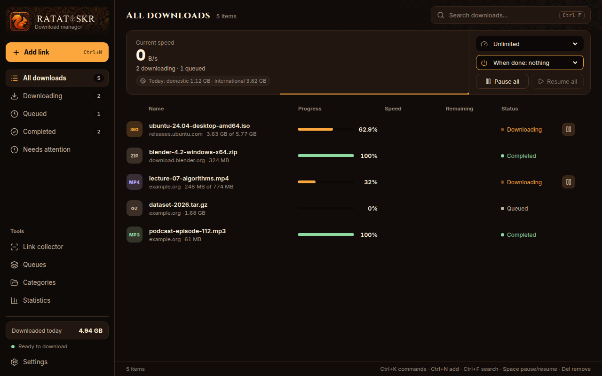
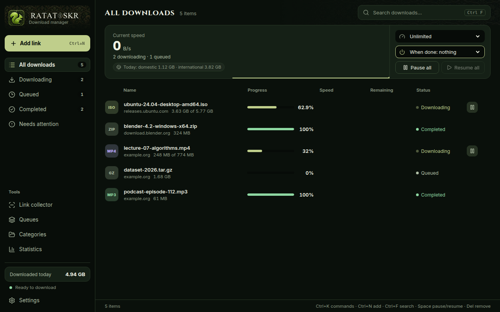
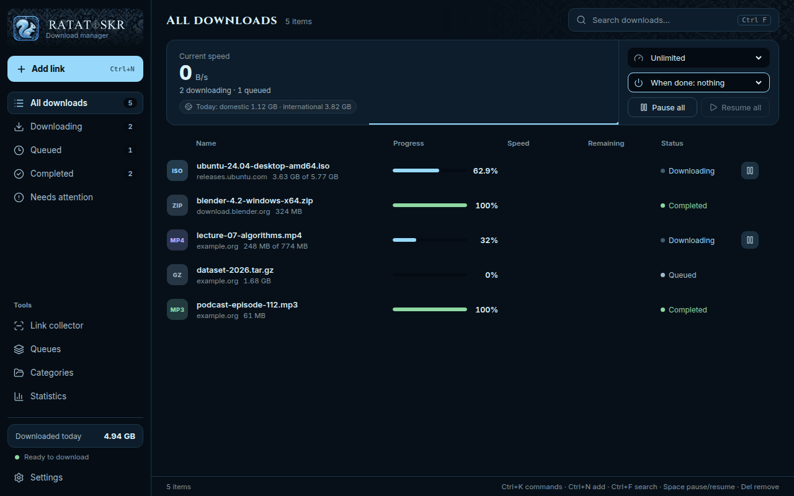

<p align="center">
  
</p>

<p align="center">
  <b>A fast, local-first download manager for Windows and Android.</b><br>
  Persian-first and fully bilingual · segmented &amp; resumable · YouTube and Instagram built in
</p>

<p align="center">
  <a href="https://github.com/sajjadka21/ratatoskr/releases/latest"></a>
  <a href="https://github.com/sajjadka21/ratatoskr/releases/latest"></a>
  <a href="https://github.com/sajjadka21/ratatoskr"></a>
</p>

<p align="center">
  <a href="https://github.com/sajjadka21/ratatoskr/actions/workflows/ci.yml"></a>
  
  
  
  <a href="LICENSE"></a>
  · <a href="README.fa.md">فارسی</a>
</p>

<p align="center">
  
</p>

---

Ratatoskr is named after the squirrel of Norse myth who runs up and down the
world tree carrying messages between its crown and its roots. This one carries
files down to your disk — reliably, quickly, and without sending anything to a
server of ours. There is no account, no telemetry and no backend: the download
engine, the database and the settings all live on your computer.

## Features

**Downloading**
- Segmented, resumable transfers with adaptive connection counts, mirrors and
  automatic retry; interrupted downloads recover after a crash or reboot.
- Queues with priorities, per-host limits and schedules (once, daily,
  weekdays, repeating) with a completion action (notify, exit, sleep, shut down).
- Categories and rules that pick the folder for you; speed limits; traffic
  statistics split into domestic and international.
- Safety guards on what gets saved and where, and no cookies or credentials
  in logs.

**Getting links in**
- **Link collector** — paste a page or text and pick the files from it; with
  **site grabber** it crawls a site (depth, same host/folder, file types) politely,
  one page at a time.
- **Floating drop box** — drop links or text on a small always-on-top target.
- **Videos** — YouTube, Aparat, **Instagram** and many more sites through the
  bundled, self-updating yt-dlp. See the [Instagram guide](docs/INSTAGRAM.md).
- **Browser extension** for Chrome, Edge, Brave and Firefox: right-click
  *Download with Ratatoskr*, a video button on supported sites, optional takeover
  of browser downloads, optional login handover for a single download.
- **Command line** — `tosk add <url>`, `tosk list`, `tosk pause-all`, …

**Feels right**
- Persian (right-to-left) and English, switchable in Settings.
- Four hand-made themes from the brand kit — *Ember Forge*, *Midnight Arcane*,
  *Forest Rune*, *Frost Byte* — each with its own squirrel and pattern.
- Finish sound, file date taken from the server, *new queue* from the context
  menu, tray icon, keyboard shortcuts (`Ctrl+N`, `Ctrl+K`, `Ctrl+F`, `Space`, `Del`).
- **Portable edition** that keeps everything in a folder beside the program.

## Screenshots

| Midnight Arcane (Persian, right-to-left) | Forest Rune | Frost Byte |
|---|---|---|
|  |  |  |

## Install

### Windows

Download from the [latest release](https://github.com/sajjadka21/ratatoskr/releases/latest):

| File | For |
|---|---|
| `Ratatoskr_x.y.z_x64-setup.exe` | The installer (recommended). Updates itself from signed releases. |
| `Ratatoskr-portable.zip` | Unzip anywhere (a USB drive works). Data stays in `data\` beside the program. |

Windows may show a SmartScreen warning because the installer is not signed with
a paid code-signing certificate yet. Choose **More info → Run anyway**. Updates
are still verified against the public key built into the app.

### Android

Download `Ratatoskr-android.apk` from the release and open it (allow installing
from your browser when asked). Then, in YouTube or Instagram, press **Share →
Ratatoskr**, pick a quality and the download continues in the background. See
[android/README.md](android/README.md). The Android app is a preview: it builds
in CI but has had little real-device testing.

### Telegram bot (optional)

[`telegram-bot/`](telegram-bot/README.md) is a small bot with the same name
that downloads Instagram, YouTube and Spotify (by search) links for you in
Telegram. You run it yourself on a server outside Iran.

## Instagram

Copy a post, reel or IGTV link and press `Ctrl+N` — or use the extension's
button on the page, or **Share → Ratatoskr** on Android. Public posts need no
login. The full guide (including what does not work) is in
[docs/INSTAGRAM.md](docs/INSTAGRAM.md).

## Command line

```text
tosk add https://example.com/file.iso          # add and start
tosk add --later https://example.com/big.zip   # add, start later
tosk list [--status downloading] [--json]
tosk pause|resume|cancel <id>...               # ids may be shortened
tosk pause-all
tosk queue start "Default Queue"
```

`tosk` talks to the running app (starting it if needed), so there is one engine
and one record of every download.

## Build from source

Requirements: Node 22, Rust (stable), and on Windows the WebView2 runtime.

```powershell
npm install
npm run tauri dev          # run the desktop app
npm run build              # build the UI
cargo test --workspace     # Rust tests
cargo clippy --workspace --all-targets -- -D warnings
npm test                   # UI tests
```

Release builds (installer, portable zip, APK) are produced by GitHub Actions
when a `v*` tag is pushed. See [RELEASING.md](RELEASING.md) for signing keys
and the step-by-step.

## Architecture

Rust owns every piece of critical state; React only presents it.

| Crate | Role |
|---|---|
| `dm-core` | download engine, queues, rules, link collector, site grabber, yt-dlp |
| `dm-storage` | SQLite persistence and migrations |
| `dm-ipc` | contracts between the UI, the host and the tools |
| `dm-system` | Windows power, sleep, sparse files, locating the app |
| `dm-native-host` | Native Messaging host for the browser extension |
| `dm-cli` | `tosk`, the command-line tool |
| `src-tauri` | the desktop application (Tauri 2) |

More in [docs/architecture.md](docs/architecture.md) and
[docs/download-state-machine.md](docs/download-state-machine.md).

## Principles

Local-first · no mandatory backend · Rust owns critical state · reliability
before feature count · never store credentials or browser secrets in logs.

## Brand

The name, squirrel icons, patterns and four colour themes come from the
Ratatoskr brand kit; see [docs/brand](docs/brand).

## License

[MIT](LICENSE). yt-dlp is bundled under its own (Unlicense) terms. Please
download only content you have the right to save.
